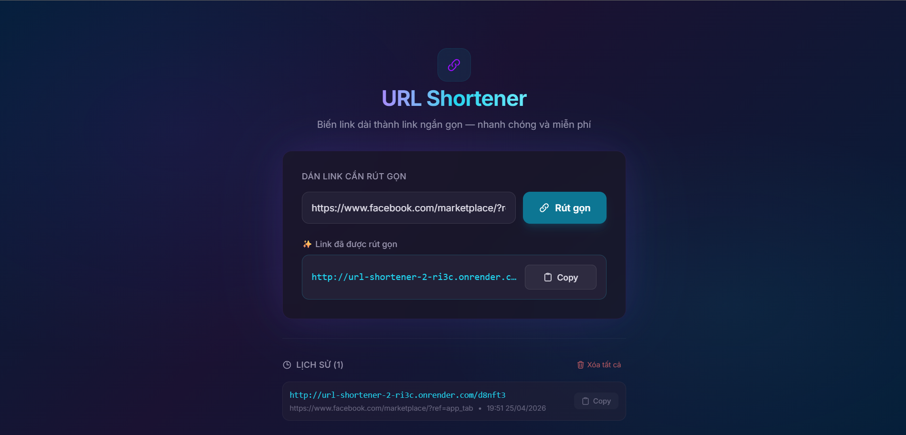

#  URL Shortener

A fullstack URL Shortener application that allows users to convert long URLs into short, shareable links.

## Live Demo

* Frontend: https://url-shortener-jnof.vercel.app/
* Backend API: https://url-shortener-2-ri3c.onrender.com

---

## Preview



---

## Features

* Shorten long URLs into compact links
* Redirect to original URL instantly
* Copy short link to clipboard
* View history of generated links
* Responsive and user-friendly interface

---

## Tech Stack

### Frontend

* React + TypeScript
* Vite
* Tailwind CSS

### Backend

* Node.js + Express.js
* TypeScript
* Database (SQLite)

### Deployment

* Frontend: Vercel
* Backend: Render

---

## Project Structure

```
Url_Shortener/
│
├── backend/ # Express + TypeScript backend
├── frontend/ # React + TypeScript frontend
├── screenshots/ # Images for README (UI preview, demo)
├── .gitignore
└── README.md
```

---

## Installation & Setup

### 1. Clone repository

```bash
git clone https://github.com/nnQuang123/URL_Shortener.git
cd URL_Shortener
```

---

### 2. Setup Backend

```bash
cd backend
npm install
```

Create `.env` file:

```
DATABASE_URL=your_database_url
```

Run backend:

```bash
npm run dev
```

---

### 3. Setup Frontend

```bash
cd frontend
npm install
npm run dev
```

---

## API Documentation

### POST /shorten

**Request:**

```json
{
  "url": "https://example.com"
}
```

**Response:**

```json
{
  "shortUrl": "https://url-shortener-2-ri3c.onrender.com/abc123"
}
```

---

## How It Works

1. User enters a long URL in the frontend
2. Frontend sends request to backend API
3. Backend generates a unique short code
4. Short URL is returned and stored
5. When accessed, backend redirects to original URL

---

## Future Improvements

* User authentication (login/register)
* Click analytics
* Dark mode
* Custom domain support

---

## Author

* GitHub: https://github.com/nnQuang123
